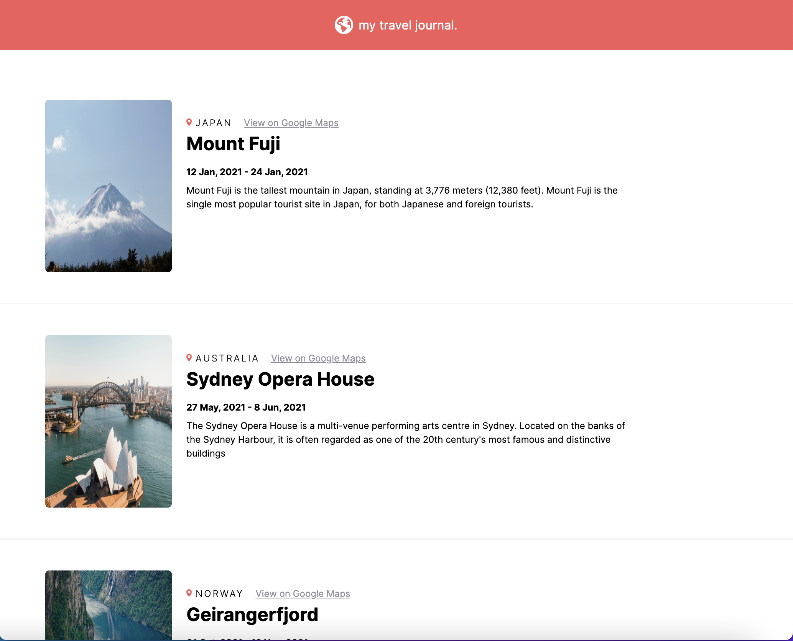

# Travel Journal

This project was created using ReactJS. I found the usefulness of sending objects to components as props in order to create self updating web pages. The program reads through a data file and creates a component (the travel destination and details) based on the information read.

# Getting Started with Create React App

This project was bootstrapped with [Create React App](https://github.com/facebook/create-react-app).

## Available Scripts

In the project directory, you can run:

### `npm start`

Runs the app in the development mode.\
Open [http://localhost:3000](http://localhost:3000) to view it in your browser.

The page will reload when you make changes.\
You may also see any lint errors in the console.
